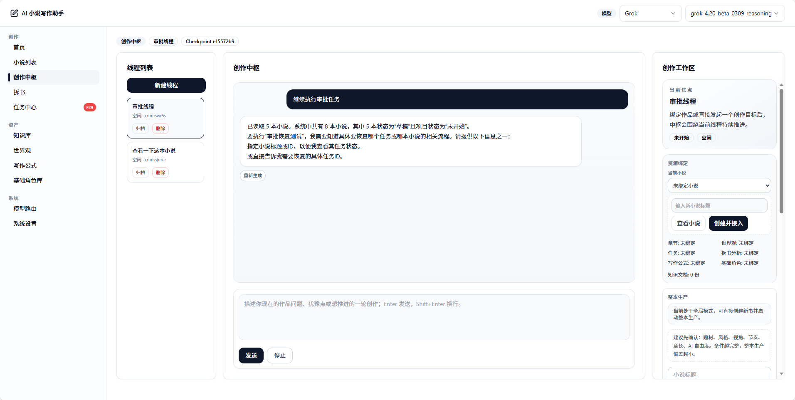
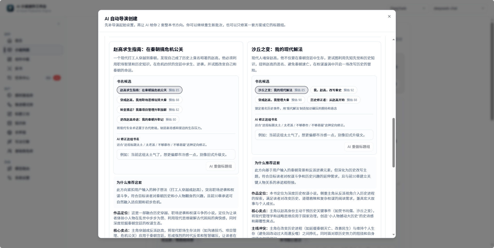
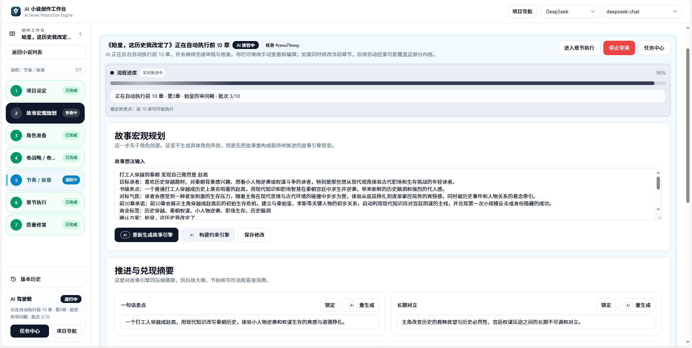
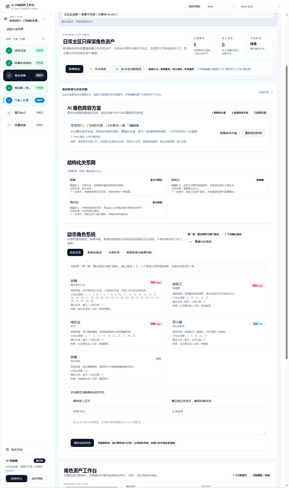
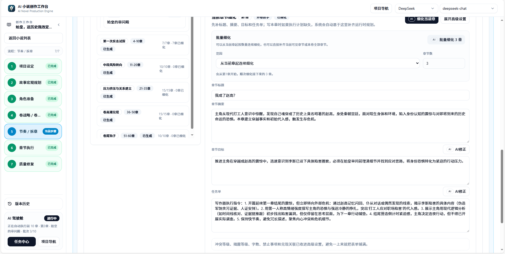
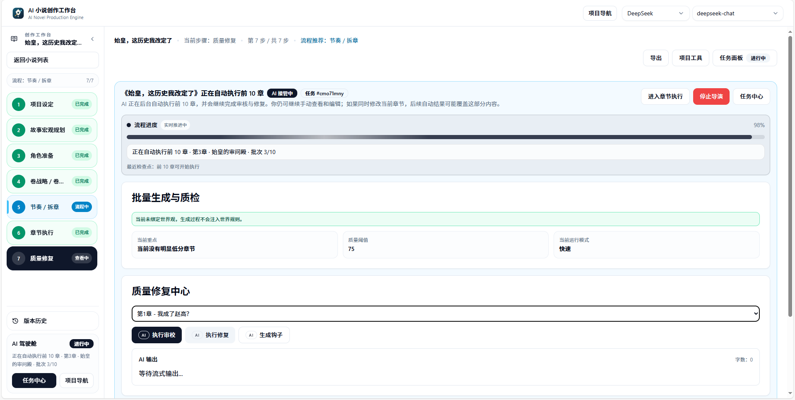
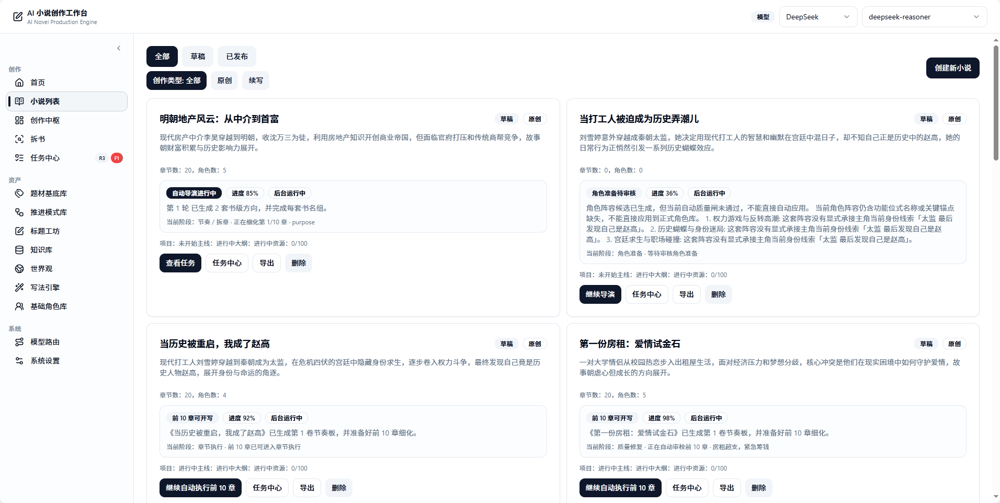
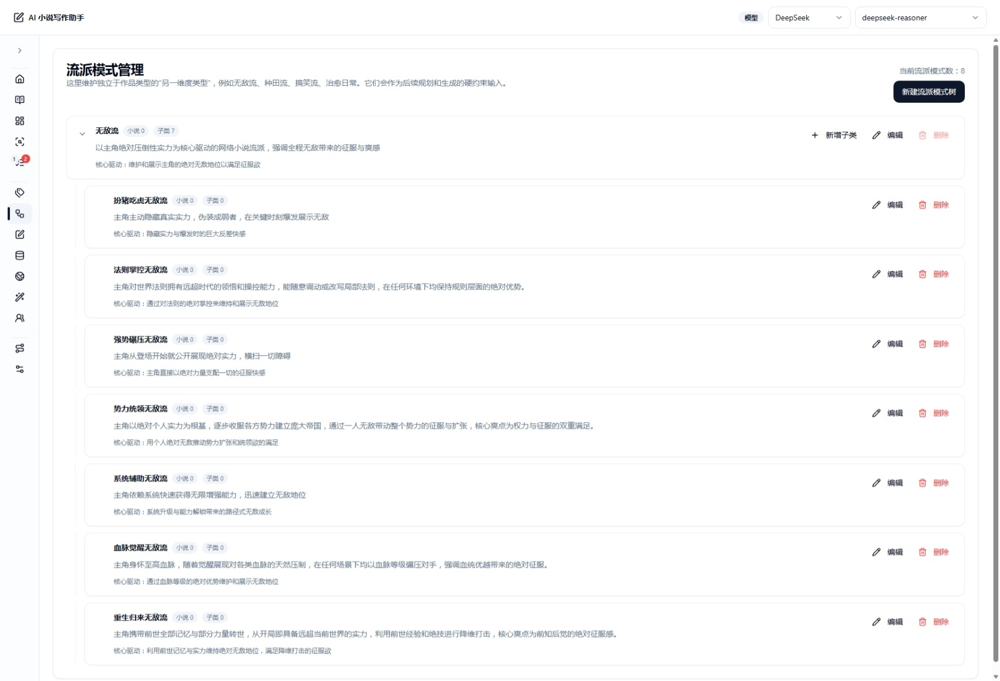
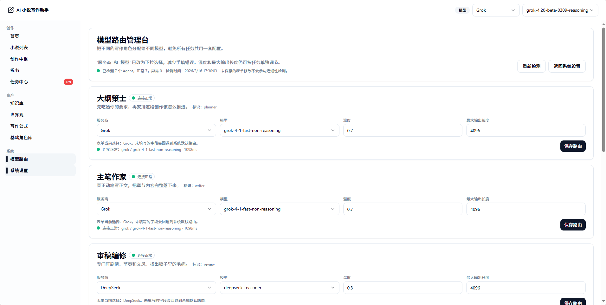

# AI Novel Production Engine / AI 小说创作工作台

An open-source, AI-native system for producing full-length novels.

Current development focus:
`Creative Hub + AI Director book-opening + per-book world context + full-book production pipeline + Style Engine`


## ✨ Overview

This is an **AI production system for full-length novels**.

It is not the usual "you write a sentence, the AI appends a sentence" chat mode. Instead it lets you:

- 👉 Start from a single idea
- 👉 Automatically build the world, characters, and plot structure
- 👉 Manage knowledge and settings (RAG)
- 👉 Control writing style and narrative consistency
- 👉 Finally generate complete chapters — even an entire book

> 本项目同时面向中文用户。如需中文说明，参见下方“中文简介”。

### 中文简介

这是一个面向长篇小说的 AI 生产系统。从一个想法出发，自动构建世界观、人物与剧情结构，管理知识与设定（RAG），控制写作风格与叙事一致性，最终生成完整章节甚至整本小说。面向完全不懂写作的新手优先设计，核心目标是“把整本书写完”。

## Windows Desktop Edition

If you just want to download, install, and start writing, use the desktop build:

- Downloads: [GitHub Releases](https://github.com/ExplosiveCoderflome/AI-Novel-Writing-Assistant/releases)
- Latest version: [Latest Release](https://github.com/ExplosiveCoderflome/AI-Novel-Writing-Assistant/releases/latest)
- Prefer the `Setup.exe` installer. If you do not want to install, or want to run it from a USB stick / temporary folder, choose the `portable` build instead.


## Project Positioning

Most AI writing tools work the same way:
- You type a prompt
- It returns a passage
- If you are not satisfied, you retry
- Fine for short pieces — but for a full novel, the writing drifts apart over time

This repository is an **"AI-director long-form novel production system"**, not another writing-chat shell.

Its core product decisions:

- The target users are first and foremost complete beginners who do not know how to write — not experienced authors fluent in structural design.
- It prioritizes "how to finish an entire book" first, then iteratively improves "how refined the writing is."
- The AI is not just a text-completion model; it participates as a system role across planning, judgment, scheduling, execution, and tracking.

This repository is worth your attention if you are looking for:

- Evidence that AI can participate in full-book novel production, not just single passages.
- How AI-native products, agent workflows, and LangGraph orchestration land on a real creative business.
- A stable workflow that chains worldbuilding, characters, book analysis, a knowledge base, style control, and chapter generation.


## Available Capabilities

### 1. AI Director book-opening

- Start from a single fuzzy inspiration and go straight into the AI director — no need to figure out the world, main plot, characters, and volume outlines yourself first. The system first consolidates project settings, aligns the book-level framing, then generates multiple full-book directions with matching title sets.
- Direction selection is no longer just "accept or regenerate the whole batch." If the first round misses, generate the next round; if one direction feels right, let the AI refine just that plan, or redo only its title set.
- Director creation supports three advance modes: `Review by key milestones`, `Advance until ready to write`, and `Auto-execute the first 10 chapters`. The pipeline chains book-level direction, macro story planning, per-book world preparation, character preparation, volume strategy, pacing/chapter splitting, and chapter execution into one continuous flow.
- The pipeline supports checkpoint recovery, taking over existing projects, in-page continuation, and model-switch retries. After `chapter_batch_ready` you can either enter chapter execution directly, or let the AI auto-run the first 10 chapters through writing, review, and repair.
- The character stage no longer unconditionally commits the first roster. It now prioritizes generating character assets that can enter the prose directly; if character names still look like role-slots, lack identity anchors, or are unstable in quality, the system stops at the character review point rather than carrying a bad roster into later volume planning and chapter splitting.

### 2. Creative Hub and Agent Runtime

- `Creative Hub` is no longer just a chat page — it is converging into a unified creative hub: conversation, follow-ups, planning, tool calls, execution status, and turn summaries are all merging here.
- The system has clear Planner, Tool Registry, Runtime, approval nodes, status cards, and interrupt-recovery links — showing the focus is no longer "can the AI write" but "can the AI organize a real creative workflow."
- If you care about how AI-native products land, this is no longer a scattered pile of buttons; it is growing a skeleton worth building on.

### 3. Full-book production pipeline

- Single-chapter runtime, chapter execution, and full-book batch pipeline are converging onto one main chain — no longer the fragmented "a trial entry here, a batch button there."
- You can launch a full-book writing task from structured planning, a chapter outline, and asset readiness, and keep watching the current stage, failure reasons, and next-step suggestions.
- It is not yet a one-click book machine you never have to manage — but it is also past the "only good for screenshots" stage. The main chain really does advance.

### 4. Style Engine

- Writing style is no longer just a long paragraph inside a prompt; it is a long-term asset you can save, edit, bind, trial-write, and reuse.
- You can extract style features from existing text and save the original sample alongside, so you no longer rely on memory to guess "where that flavor came from."
- Extracted features settle into a visible feature pool; once in the editor you can enable, disable, and combine them per item, and the style rules recompile in sync — convenient for trial writing, correction, and full-book binding.
- This means the Style Engine is genuinely participating in generation, detection, and correction — not a sidebar concept feature.

### 5. Per-book world, characters, book analysis, and knowledge base

- The world is no longer just a wall of setting text — you can generate a world skeleton from world intent, then settle it into a world manual, rules, factions, locations, relationships, and conflict entry points.
- Each novel can have its own per-book world: import from the world library, generate by book theme, manually sync differences, or save back to the world library for reuse.
- World maps and faction graphs enter the chapter context, and character preparation can leverage faction tendencies, world rules, and identity boundaries to produce characters that fit the stage.
- Book analysis results and knowledge-base documents can feed back into planning, continuation, and prose generation; the system retrieves relevant context by the current chapter task, characters, and conflicts — not just a one-shot prompt.

### 6. Model routing and local running

- Supports multiple providers (OpenAI, DeepSeek, SiliconFlow, xAI, …); planning, prose, and review pipelines can be routed to different models.
- The frontend and backend are split into a monorepo, suitable for sustained local development and for extending toward a Prompt Registry, Workflow Registry, and Runtime.
- SQLite is enough by default to run the main pipeline; wire up Qdrant only when you want the full knowledge-base / RAG experience — you do not have to stand up all the infrastructure up front.


## Typical Workflow

1. On the novel-creation page, type one spark of inspiration and let the AI director propose full-book direction candidates.
2. Go to `Project Settings` and settle the genre, selling points, target reader feel, and the first-30-chapter promise.
3. Use `Macro Story Planning`, `Per-book World`, and `Character Preparation` to bring the main plot, stage boundaries, and character network up to "ready to write."
4. Enter `Volume Strategy / Volume Skeleton` to decide the volumes, then `Pacing / Chapter Splitting` to land the current volume on a chapter list and per-chapter detail.
5. Bind book-analysis results, knowledge-base documents, and style assets as needed, so later prose does not rely on a one-shot prompt.
6. Enter `Chapter Execution` to write, audit, and repair chapter by chapter; return to the volume workspace to rebalance and re-plan when needed.
7. When you want to move faster, launch a full-book production task and keep watching status, failure reasons, and fed-back results.

## Full-length Generation Support Map


- The book-opening framing first clarifies "what kind of book this will be," preventing drift later.
- The full-book control layer and volume-planning layer break a long form into a structure that is advanceable, reviewable, and adjustable — not written once and frozen.
- Characters, world, style, knowledge base, and quality control together support single-chapter generation, keeping every chapter inside the same book.
- After each chapter, the system feeds the new state back in, continuing to affect later chapters, volume pacing, and re-planning when needed.

## 最新更新

For the full update history, see [docs/releases/release-notes.md](./docs/releases/release-notes.md).

### 2026-06-09

彻底修复了正文即兴写出的硬设定（交易性质、金额、票号、数量等）无法跨章保持一致的问题，并新增便于反复测试的章节重置工具。

- 章节定稿时自动抽取正文中的关键硬事实并写入事实账本，下一章生成时即可读到真实前文，消除"私下交易被改写成公务流程"这类跨章设定矛盾。
- 章节摘要与事实抽取已接入全书自动执行流程，不再只能从前端手动触发。
- 新增"重置所有章节正文"开发工具，便于反复重新生成测试。
- 修复懒规划（JIT）模式下结构化大纲步骤被误报"未产出"的问题；补充小说生成质量守卫（世界观污染词防护、关键节点守卫、章节连续性诊断）。

## Feature Preview
### Over 95% of the feature overview was written by AI

These screenshots prioritize the single-book workflow used by the current version: from AI-director book opening, through project settings, macro story planning, character preparation, volume strategy, pacing/chapter splitting, and chapter execution, to quality repair — converging into one continuous advance chain rather than a set of disconnected demo pages.

### Creative Hub

A creative hub carrying conversation, planning, tool execution, and creative advancement.



### AI Director Mode

The director-creation page brings one inspiration, the director's starting parameters, book-level framing, model settings, and run mode into one panel; after entering direction selection it does not just give you two full-book plans — it adds title-set options, recommendation reasons, and a targeted redo entry, suited to settling "how to open this book."





### Project Settings

Project settings are attached to the single-book workflow's continuous flow: the left shows the current step and overall progress, the top shows the AI takeover status, and the body area handles the title, summary, book-level framing, style confirmation, and the world boundaries this book will actually use.


### Macro Story Planning

Macro story planning is no longer just a long summary — it first compresses the story engine, advancement-and-payoff summary, long-term opposition, and first-30-chapter promise into a reusable book-level guidance layer, ensuring the whole-book main plot is pushable, then builds volume- and chapter-level planning on that base.



### Character Preparation

The character-preparation page is now more of a character workspace than a character form: it inventories the core characters of the target section, then gives an AI roster, a structural relationship network, and a dynamic character system — reducing post-opening gaps, missing role-slots, and stalled relationship advancement.



### Volume Strategy / Volume Skeleton

The volume-strategy stage now explicitly distinguishes four phase completions: volume strategy, volume skeleton, pacing board, and chapter splitting. The system first checks whether you are ready to advance, then generates volume-strategy suggestions, reviews the volume skeleton, and brings version control and impact analysis onto one page.


### Pacing / Chapter Splitting

Pacing / chapter splitting now puts the pacing-segment list, batch refinement, per-chapter title, summary, chapter goals, and task sheet into one workspace; you can refine continuously over visible chapters or a specified range, and make local AI edits to summaries and goals — better suited to serialized-web-novel-style steady advancement.



### Chapter Execution

The chapter-execution page is now more of a main writing workspace: the left has chapter cards and next-step status, the center has saved prose and version history, and the right brings the execution plan, prose writing, review, repair, status sync, and foreshadow backfill into one action panel — suited to advancing chapter by chapter.


### Quality Repair

Quality repair has converged from scattered buttons into an independent workspace: you can run the current chapter's review, run repair, generate hooks, and keep going against the current batch, quality thresholds, and AI output — bringing "how to stabilize quality after writing" into the main flow.



### Text Editing

Once a chapter has prose, you can enter an independent text editor for local rewrites. The text-editing page keeps the task sheet, audit results, and repair links attached to that chapter, so you do not lose context between the "main writing area" and the "fine-tuning area."


### Novel List

Enter book opening, management, editing, and full-book production from here.



### Book Analysis

Break a reference work into structured knowledge, then feed it back into the creative pipeline.


### Knowledge Base

Unified management of documents, indexes, rebuild tasks, and retrieval.


### World

The world is no longer just descriptive text — it can generate a world skeleton, maintain a world manual, and bind as each novel's own per-book world context.


### Character Library

Unified maintenance of base character profiles and in-novel character information.


### Category Management

Centrally maintain genre and category assets so story planning, character preparation, and prose generation share one genre vocabulary.


### Story Mode Management

Collect advancement mode, payoff style, and conflict boundaries into reusable story-mode assets, making it easier for the whole book to hold reader expectations.



### Title Workshop

Batch-generate, filter, and fine-tune book titles and title directions, lowering the trial-and-error cost for beginners at the naming stage.


### Style Engine and Anti-AI Rules

Unified management of style assets, style constraints, and anti-AI rules, so the prose reads more like the work itself and less like template completion text.


### Task Center

View the queue, execution, and failure status of book analysis, knowledge-base rebuilds, and other background tasks.


### Model Configuration

Assign different models to different capabilities, reducing the cost of one model handling every task.



## Quick Start

### Requirements

- Node.js `^20.19.0 || ^22.12.0 || >=24.0.0`
  `20.19.x LTS` recommended
- pnpm `>= 10.6`
  The repo's pinned `pnpm@10.6.0` recommended
- At least one usable LLM API key
  You can also get the project running first and configure keys in the UI
- For the full knowledge-base / RAG experience, also prepare a usable Qdrant instance

### 1. Install dependencies

```bash
pnpm install
```

The default `pnpm install` only prepares Web / Server dev dependencies; it does not force-download the Electron desktop runtime on first install.

- If you only run the existing Web / Server dev flow, this is enough
- To launch the desktop dev shell, the first `pnpm dev:desktop` auto-pulls the Electron runtime
- To do this ahead of time, run:

```bash
pnpm run prepare:desktop-runtime
```

The desktop runtime first-download needs network access to an Electron distribution source; if your network cannot reach GitHub Releases, configure a proxy or mirror before running desktop commands.

If `pnpm install` hangs on `prisma preinstall` on Windows, check these two things first:

1. Node version too low
   Prisma 7 requires Node `^20.19.0 || ^22.12.0 || >=24.0.0`. If you are still on `20.0 ~ 20.18`, upgrade to `20.19.x LTS` before installing.
2. `script-shell` set to an interactive shell
   If the global `npm/pnpm script-shell` is set to something like `cmd.exe /k` that keeps a prompt, the Prisma lifecycle script may not exit on its own and the install looks "stuck" at:
   `node_modules/.../prisma>`

Self-check with:

```bash
node -v
pnpm config get script-shell
npm config get script-shell
```

If `script-shell` returns a `cmd.exe` with `/k`, delete that setting and reopen the terminal:

```bash
npm config delete script-shell
pnpm config delete script-shell
```

Then re-run:

```bash
pnpm install
```

### 2. Configure environment variables

This repo starts the frontend and backend through a pnpm workspace, so environment variables are read per sub-package:

- The server runs in the `server/` working directory and reads `server/.env`
- The client runs in the `client/` working directory and reads `client/.env` / `client/.env.local`
- The root `.env.example` is best treated as an "overview reference," not the main entry `pnpm dev` reads

#### 2.1 Server environment variables

Copy the server example file first:

```bash
# macOS / Linux
cp server/.env.example server/.env

# Windows PowerShell
Copy-Item server/.env.example server/.env
```

At minimum, confirm these:

- `DATABASE_URL`
  Defaults to local SQLite; usable as-is
- `RAG_ENABLED`
  If you are not wiring up the knowledge base yet, set this to `false`
- `QDRANT_URL`, `QDRANT_API_KEY`
  Only needed when enabling Qdrant / RAG

Notes:

- `OPENAI_API_KEY`, `DEEPSEEK_API_KEY`, `SILICONFLOW_API_KEY` and the like can be left empty for now
- After the project starts, you can also configure model providers and default models in the UI

#### 2.2 Client environment variables

For most local-dev scenarios you do not need a separate client env.

In dev mode the frontend points the API to:

```text
http(s)://<current-page-hostname>:3000/api
```

This also covers "start the server on this machine, then access it from another device over LAN IP."
For example, with the page open at `http://192.168.0.37:5173`, the frontend auto-points the API to:

```text
http://192.168.0.37:3000/api
```

Only create `client/.env` in these cases:

- Frontend and backend are not on the same machine
- You want to point the frontend at a different API address
- You need to pin `VITE_API_BASE_URL`

If you copied `client/.env.example` and find browser requests going to `http://localhost:3000/api`, you most likely pinned the API explicitly. For same-machine / LAN access, delete or comment out `VITE_API_BASE_URL`.

Example:

```bash
# macOS / Linux
cp client/.env.example client/.env

# Windows PowerShell
Copy-Item client/.env.example client/.env
```

The content usually only needs:

```env
# For same-machine / LAN access, this line is usually not needed
# VITE_API_BASE_URL=http://localhost:3000/api
```

#### 2.3 Model providers do not have to be hardcoded in env

The project supports configuring model-related settings in the UI:

- `/settings`
  Configure provider API keys, default models, connectivity tests
- `/settings/model-routes`
  Assign different provider / model per task
- `/knowledge?tab=settings`
  Configure Embedding provider, Embedding model, collection naming, and auto-rebuild strategy

So `OPENAI_MODEL`, `DEEPSEEK_MODEL`, `EMBEDDING_MODEL` and similar env vars are best treated as:

- Startup defaults
- Fallbacks when nothing is saved in the database yet

### 3. Start the dev environment

```bash
pnpm dev
```

If you have copied `server/.env` and `client/.env`, this single command runs by default.
You do not need to manually run `prisma generate`, `prisma db push`, or `pnpm db:migrate` before the first start.

By default:

- Frontend: `http://localhost:5173`
- Backend: `http://localhost:3000`
- API: `http://localhost:3000/api`

On first server start, Prisma generate and `db push` run automatically.
Only when you have modified the Prisma schema, or are handling a formal migration flow, do you need Prisma / database commands manually.

Recommended first steps after first launch:

1. Open `http://localhost:5173/settings` and configure at least one usable model-provider API key
2. Open `http://localhost:5173/settings/model-routes` and review the model routing actually used by each task
3. To enable the knowledge base, open `http://localhost:5173/knowledge?tab=settings` and save the Embedding / Collection settings

### 4. If you use Qdrant Cloud

If you just want to try the main flow, you can skip Qdrant and set in `server/.env`:

```env
RAG_ENABLED=false
```

To enable Qdrant Cloud, follow this minimal flow:

1. Register an account at [Qdrant Cloud](https://cloud.qdrant.io/).
2. Create a cluster on the `Clusters` page.
   A Free cluster is enough for testing.
3. After the cluster is created, copy the Cluster URL from the cluster detail page.
4. In the cluster detail page's `API Keys`, create and copy a Database API Key.
   This key is usually shown only once; save it immediately.
5. Write them into `server/.env`:

```env
QDRANT_URL=https://your-cluster.region.cloud.qdrant.io:6333
QDRANT_API_KEY=your_database_api_key
```

6. After starting the project, go to the `Knowledge Base -> Vector Settings` page, select the Embedding provider / model, and save the collection settings.

For this project, `QDRANT_URL` should be the REST address — the one with `:6333`.

To verify connectivity manually:

```bash
curl -X GET "https://your-cluster.region.cloud.qdrant.io:6333" \
  --header "api-key: your_database_api_key"
```

You can also append `:6333/dashboard` to the cluster address to open the Qdrant Web UI.

Qdrant docs:

- [Create a Cluster](https://qdrant.tech/documentation/cloud/create-cluster/)
- [Database Authentication in Qdrant Managed Cloud](https://qdrant.tech/documentation/cloud/authentication/)
- [Cloud Quickstart](https://qdrant.tech/documentation/cloud/quickstart-cloud/)

### 5. Optional initialization

None of these are prerequisites for the first `pnpm dev`:

```bash
pnpm db:seed
pnpm db:studio
```

## Common Commands

```bash
pnpm dev
pnpm build
pnpm typecheck
pnpm lint
# Only use manually when developing / adjusting the Prisma schema
pnpm db:migrate
pnpm db:seed
pnpm db:studio
pnpm --filter @ai-novel/server test
pnpm --filter @ai-novel/server test:routes
pnpm --filter @ai-novel/server test:book-analysis
```

## Tech Stack and Architecture

### Tech Stack

| Layer | Technology |
| --- | --- |
| Frontend | React 19, Vite, React Router, TanStack Query, Plate |
| Backend | Express 5, Prisma, Zod |
| AI orchestration | LangChain, LangGraph |
| Database | SQLite |
| RAG | Qdrant |
| Engineering form | pnpm workspace monorepo |

### Monorepo Structure

```text
client/   React + Vite frontend
server/   Express + Prisma + Agent Runtime + Creative Hub
shared/   Types and protocols shared by frontend and backend
images/   README and product-preview screenshots
scripts/  Startup and helper scripts
docs/     Design docs, phase checkpoints, module plans, and history archive
```

See [docs/README.md](./docs/README.md) for finer documentation分区 notes.

### Current System Focus

- `Creative Hub` — unified creative hub and agent runtime experience
- `Novel Setup / Director` — from one inspiration to a full-book "ready to write"
- `Novel Production` — the full-book generation main chain
- `Style Engine` — style assets, feature extraction, binding, and anti-AI cooperation
- `Knowledge / Book Analysis / World` — long-term context settling and feedback

## Roadmap

The priority is not to keep stacking scattered features, but to raise the success rate of "a beginner finishes a whole book."

### P0

- Stabilize continuous AI-director execution, reducing false stops, repeated reviews, and abnormal token consumption
- Let per-book world, characters, foreshadowing, timeline, and chapter tasks reliably enter later writing context
- Lower the judgment and repair cost for a beginner to go from one inspiration to continuously writing chapters

### P1

- Improve whole-book consistency, pacing stability, character-growth quality, and world-state inheritance quality
- Close the loop among style assets, world constraints, chapter re-planning, review feedback, and quality debt
- Make the system better at "continuously steering the whole book," not just "generating one chapter"

### P2

- Strengthen multi-stage agent cooperation and runtime observability
- Improve more automated production scheduling, recovery strategies, turn memory, and whole-book quality control

## Feedback

To report issues, share your experience, or discuss the AI director, the full-book production chain, the style engine, and other directions, scan the QR code to join the QQ group.


## Contributing

If you want to participate, the most valuable contribution directions include:

- Improving full-book production stability
- Improving the beginner book-opening experience and AI-director success rate
- Strengthening the style engine, knowledge-base feedback, and world-consistency links
- Adding tests, error replay, and runtime observability

Issues and Pull Requests are welcome.
Submitting a Pull Request confirms you have the right to submit that content and have read and agreed to [CLA.md](./CLA.md); if it includes third-party code, assets, AI-generated content, or other license-bound content, state the source and license clearly in the PR. See [CONTRIBUTING.md](./CONTRIBUTING.md).

## Acknowledgements

Thanks to [@ystyleb](https://github.com/ystyleb) for fix Pull Requests.


## Notes

- This is a fast-iterating AI-native creative system; its feature boundaries are still evolving.
- The README prioritizes the capabilities most worth experiencing and most representative of the direction, rather than listing all historical implementation details.
- For phase goals, priorities, and follow-up optimization plans, see [TASK.md](./TASK.md).

## License

This project uses a dual-license model:

- By default, this project is licensed under the GNU Affero General Public License v3.0 (AGPLv3); see [LICENSE](./LICENSE). Attribution and additional notices are in [NOTICE](./NOTICE).
- Service-style commercial use: offering this project (or a modified version) to third parties as a backend via SaaS, hosting, or other forms requires obtaining a commercial license from the author.
- Follow the open-source license terms and obtain the corresponding authorization where applicable.

Contribution note: new contributions are submitted under [CLA.md](./CLA.md) by default, may be redistributed with the project under AGPL-3.0-only, and may be included in a separate commercial license provided by the project maintainer; see [CONTRIBUTING.md](./CONTRIBUTING.md).
